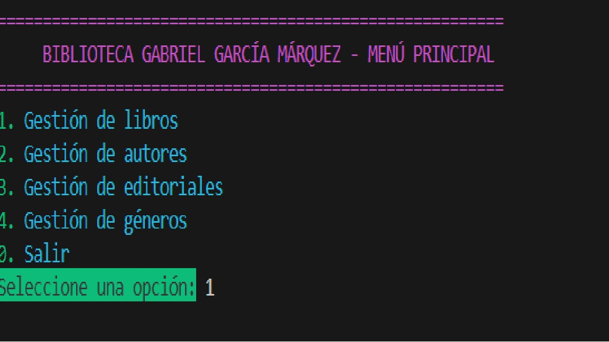
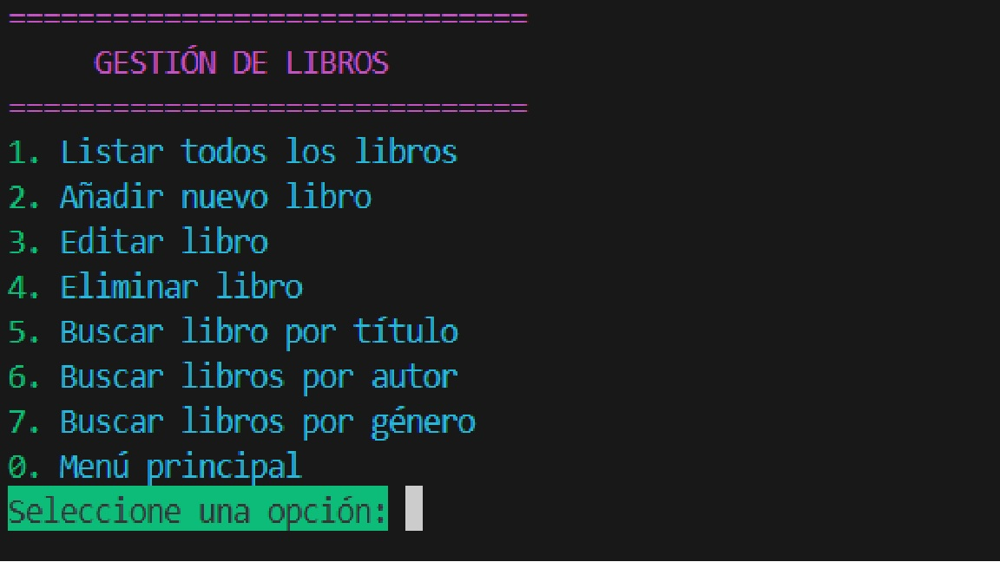
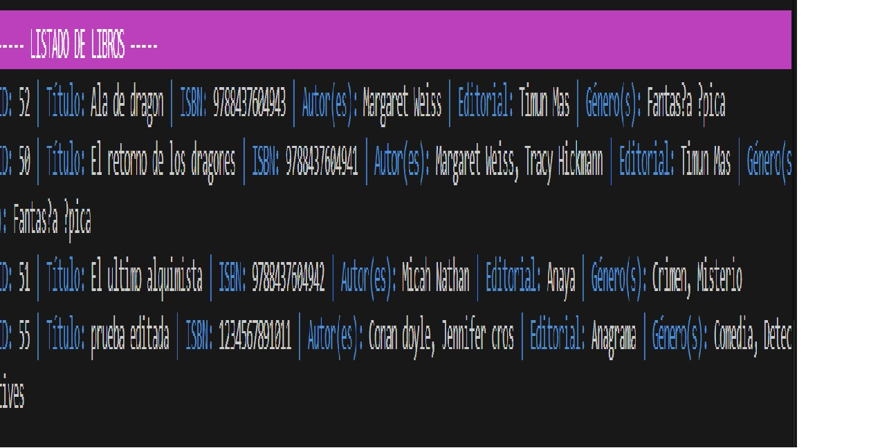
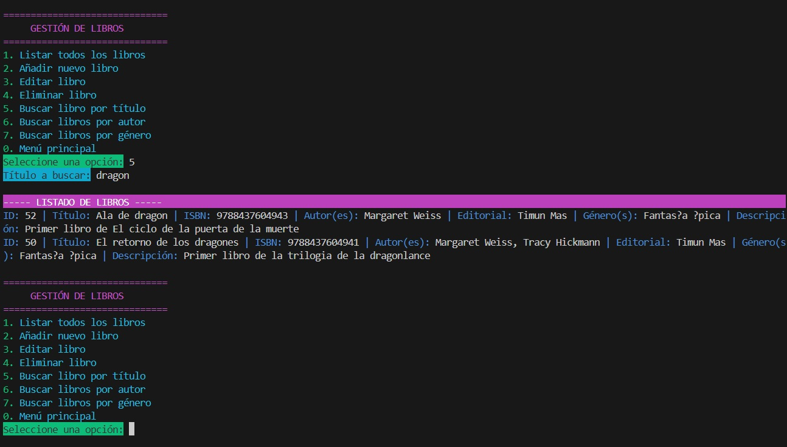

# 📚 Biblioteca Gabriel García Márquez

A backend Java application for managing a small neighborhood library inventory through a terminal-based interface.

---

## Table of Contents
1. [General Info](#general-info)
2. [Screenshot](#screenshot)
3. [Technologies](#technologies)
4. [Installation](#installation)
5. [Usage](#usage)
6. [Project Status](#project-status)
7. [Collaboration](#collaboration)
8. [FAQs](#faqs)

---

## General Info
***
The **Biblioteca Gabriel García Márquez** project was created to modernize the management of a neighborhood library by providing a structured and reliable system to manage its book inventory.

The application allows the user to create, update, delete, view, and search books using different criteria such as title, author, and literary genre. It is designed to be used by a library administrator through a clear and intuitive terminal menu, prioritizing a good user experience.

**Project type:** Backend  
**Context:** Bootcamp group project / Learning practice

---

## Screenshots

### Terminal Menu




### List Books Example


### Search by Title Example


---

## Technologies
- Java 21  
- PostgreSQL  
- Maven  
- Git & GitHub  
- JUnit  
- Mockito  

---

## Installation
Clone the repository:
```bash
git clone https://github.com/gracielagq07/biblioteca.git
```

Navigate to the project directory:
```bash
cd biblioteca
```

Configure the PostgreSQL database connection according to your local setup.
Build the project using Maven:

```bash
mvn clean install
```
---

## Usage
Run the application and interact through the terminal menu.
You can:
- View the full list of books
- Add new books to the database
- Edit existing book information
- Delete books
- Search books by title
- Search books by author
- Search books by literary genre
- The menu guides the user through each action, clearly indicating the available options and required inputs.


## Project Status
✅ Finished
The project meets all defined requirements and represents the final version delivered for the bootcamp.

## Collaboration
This is an academic learning project developed as a group using agile methodologies.
Suggestions, improvements, and feedback are welcome for educational purposes.

## FAQs
1. **Is this project finished?**
Yes, the project is complete and fulfills all the defined requirements.

2. **Can this project be used by other people?**
Yes, the project was developed for educational purposes and can be reused or extended for learning.

3. **Does the application have a graphical interface?**
No, the application is entirely terminal-based.

4. **Is there user authentication or permissions management?**
No, user authentication is not implemented in this project, only required for the connection of the DB.

5. **Was this project developed individually or in a team?**
This project was developed as a group project.

6. **Is the database normalized?**
Yes, the database design is normalized up to the Third Normal Form (3NF).

7. **Does the project include automated tests?**
Yes, the project includes unit tests implemented using JUnit, Mockito and Integration Tests.